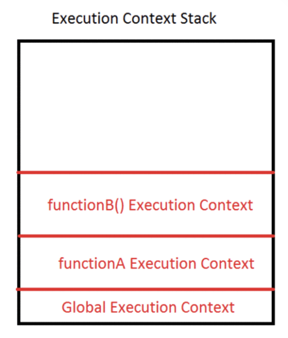

## 실행 컨텍스트

자바스크립트 코드 실행 시 제공해야 할 환경적인 정보들을 모아놓은 객체이다.
코드들을 실행 할 때 필요한 환경 정보를 모아 객체를 구성하고, 이를 코드 실행 시 콜 스택에 쌓고 가장 위에 쌓여있는 컨텍스트와 관련 있는 코드를 실행하는 식으로
전체적인 코드의 환경과 순서를 보장해준다.

이때, 환경이란 전역공간이 될 수 있고, 함수 내부의 환경이 될 수 있다.

JS의 실행 컨텍스는 3가지 종류가 있으나 Eval의 경우 거의 사용되지 않기 때문에 2각지 종류에 대해서만 알아본다.

### 전역 실행 컨텍스트 (Global Execution context(GEC))

전역적으로 자바스크립트가 실행될 때 만들어지는 실행 컨텍스트
자바스크립트는 싱글 쓰레드 언어이기 때문에 GEC는 무조건 하나만 생성된다.

### 함수 실행 컨텍스트 (Functional Execution Context(FEC))

함수가 호출되어 실행 되어질 때 실행되고 있는 함수에 대해 생성되는 컨텍스트
함수내에서 선언된 지역 변수들에 대한 정보를 담고 있다.

### 예시

```tsx
let a = 10;

function functionA() {
  console.log("Start function A");

  function functionB() {
    console.log("In function B");
  }

  functionB();
}

functionA();

console.log("GlobalContext");
```



위 코드와 사진에서 나와 있듯이, 함수가 호출되는 시점에 함수의 실행 컨텍스트가 스택에 올라가고, 함수가 반환되는 시점 (return이 있거나 없어도 return undefined 처리)에 스택에서 pop된다.
전역 컨텍스트는 프로그램이 완전히 종료될 때 (브라우저 탭을 닫거나, Node.js 프로세스가 끝날 때)까지 스택에 남아있다가 최종적으로 pop되어진다.

실행 컨텍스트는 크게 두 단계(Creation Phase와 Execution Phase)로 나뉜다.

### creation phase

- 변수 객체 (Variable Object, Activation Object) 생성
  - 해당 컨텍스트에서 ㅅ너언된 모든 변수, 함수 선언문, 인자를 하나의 객체로 만든 뒤 모두 undefined로 초기화
- 스코프 체인 초기화
  - 해당 컨텍스트가 참조해야 할 렉시컬 환경을 연결해 목록을 생성한다.
- this 바인딩 결정
  - 호출 방식(일반 호출, 메서드 호출, new 호출)에 따라 컨텍스트 내부에서 사용할 this 참조를 설정한다.

이 단계에서 변수와 함수 선언을 미리 메모리에 할당하는 호이스팅이 일어난다.

### execution phase

- 코드 한 줄씩 실행
  - creation phase에서 사전에 준비된 변수 객체에 실제 값을 할당한다.
- 함수 호출, 제어문 분기 등 실제 로직 수행
  - console.log, 연산, 다른 함수 호출 등이 이 단계에서 이뤄진다.

## 클로저 (Closure)

함수가 선언된 순간의 렉시컬 환경을 기억해 두었다가, 나중에 호출될 때도 그대로 사용하는 메커니즘

### 정의

- 함수 객체가 선언된 스코프 체인(lexicalEnvironment)를 내부 슬롯 `[[Environment]]` 에 함께 보관하고 있는 상태

### 동작 원리

- Creation Phase에서 함수가 생성될 때, 엔진은 그 함수 객체에 `[[Environment]]` 슬롯을 만들고, 여기에 선언 시점에 렉시컬 환경을 저장한다.
- 함수가 호출되면, 새 실행 컨텍스트가 이 저장된 환경을 바탕으로 외부 변수들에 접근 할 수 있게 된다.

예시를 통해 더 자세히 알아보자.

### 예시

```tsx
// 전역 렉시컬 환경을 저장
function makeGlobal() {
  console.log("hello");
}

// 중첩 함수가 상위 함수의 렉시컬 환경(count 변수)을 저장
function makeCounter() {
  let count = 0;
  return function closureFn() {
    return ++count;
  };
}

const counter = makeCounter();
console.log(counter()); // 1
console.log(counter()); // 2
```

- `makeCounter`가 실행될 때 `count`가 담긴 렉시컬 환경이 `closureFn.[[Environment]]`에 저장된다.
- `closureFn`을 호출할 때마다 이 환경을 참조해 `count` 값을 유지·갱신한다.
- `makeGlobal` 의 `closureFn.[[Environment]]`에는 전역 렉시컬 환경이 들어가게 된다. 내부에서 외부 변수를 참조하지 않기 때문에 클로저라고 하지는 않지만, 내부적으로는 전역 환경을 기억하고 있다.

### 클로저의 메모리와 가비지 컬렉션

1. 클로저로 인해 변수의 수명이 늘어나는 이유
   - 일반적인 함수의 실행이 종료되면 그 함수의 실행 컨텍스트와 렉시컬 환경은 가비지 컬렉터의 대상이 된다.
   - 그러나 내부 함수가 외부 함수들의 변수들을 참조하고 있으면, 그 환경은 사용중으로 간주되어 해제되지 않는다.
2. 클로저로 인한 메모리 누수

   **발생 상황**

   - 클로저가 불필요하게 큰 데이터 구조 (DOM 노드 참조, 대형 배열)등을 참조할 때 발생한다.
   - 이벤트 핸들러 같은 장기 실행 코드 내부에서 클로저로 DOM 요소를 캡처해두고 해제하지 않을 때 발생한다.

   **해결 방법**

   - 참조 끊기

   ```tsx
   const handler = (e) => {
     /*…*/
   };
   element.addEventListener("click", handler);
   // 더 이상 필요 없을 때
   element.removeEventListener("click", handler);
   ```

   ```tsx
   let counter = makeCounter();
   console.log(counter()); // 1
   counter = null; // 이제 내부 렉시컬 환경도 수거될 수 있음
   ```

클로저 내부 상태를 null로 처리해주거나 참조를 끊어서 메모리를 회수 할 수 있게 도와주어야 메모리 누수를 막을 수 있다.

| 구분          | Scope (스코프 체인)                                                               | Environment (함수 내부 슬롯)                                    |
| ------------- | --------------------------------------------------------------------------------- | --------------------------------------------------------------- |
| **개념**      | 실행 컨텍스트가 참조하는 렉시컬 환경들의 연결 구조                                | 함수가 선언된 순간의 렉시컬 환경을 저장하는 내부 슬롯           |
| **위치**      | 실행 컨텍스트(`lexicalEnvironment`/`variableEnvironment`)                         | 함수 객체 내부 (`[[Environment]]` 슬롯)                         |
| **구조**      | 환경 레코드들의 연결 리스트 (`environmentRecord` + `outer`)                       | 단일 참조값(환경 레코드 객체)                                   |
| **역할**      | 식별자 검색 시 현재 컨텍스트 → 상위 컨텍스트 순으로 참조                          | 클로저로 반환된 함수가 외부 변수에 접근할 때 기본 환경으로 사용 |
| **생성 시점** | 함수 호출 시(Execution Context 생성 시)                                           | 함수 정의 시(함수 객체 생성 시)                                 |
| **표기 변화** | 과거: `[[Scope]]`/`scopeChain` 현재: `lexicalEnvironment` + `variableEnvironment` | 표준 사양: `[[Environment]]`                                    |

### 스코프 체인과 프로토타입 체인의 차이

스코프 체인과 프로토타입 체인은 탐색 대상, 사용되는 시점, 구조, 생성 시점 등에서 아예 차이가 있다.

| 구분              | 스코프 체인 (Scope Chain)                                                                | 프로토타입 체인 (Prototype Chain)                                                             |
| ----------------- | ---------------------------------------------------------------------------------------- | --------------------------------------------------------------------------------------------- |
| **탐색 대상**     | 식별자(변수·함수 이름)                                                                   | 객체 프로퍼티(속성, 메서드)                                                                   |
| **언제 사용되나** | 자바스크립트 코드 실행 중, 식별자를 평가할 때                                            | 런타임에 객체의 프로퍼티 접근(`obj.prop`) 시                                                  |
| **구조**          | 실행 컨텍스트가 갖고 있는 렉시컬 환경 레코드들의 연결 리스트`{ env0 → env1 → … → null }` | 객체가 갖고 있는 `[[Prototype]]` 링크들의 연결 리스트`{ obj → obj.[[Prototype]] → … → null }` |
| **생성 시점**     | 함수 호출(또는 전역 실행) 시마다 새로 만들어짐                                           | 객체 생성 시(`{}`, `new`, `Object.create`)에 결정됨                                           |
| **검색 순서**     | 현재 환경 → 상위(outer) 환경 → … → 전역 환경 순                                          | 객체 자신 → `[[Prototype]]` → `[[Prototype]][[Prototype]]` → … 순                             |
| **목적**          | 선언된 변수나 함수가 “어디에 있는지” 찾기                                                | 객체가 해당 프로퍼티를 “어디서 물려받았는지” 찾기                                             |

이것도 예시 코드로 더 알아보자.

### 예시

```tsx
function foo() {
  let x = 1;
  function bar() {
    console.log(x); // 스코프 체인 통해 outer foo의 x 참조
  }
  bar();
}
```

```tsx
const parent = { a: 1 };
const child = Object.create(parent);
console.log(child.a); // 프로토타입 체인 통해 parent.a 참조
```

- **스코프 체인**은 **식별자 해석**을 위해 “함수(실행 컨텍스트)가 갖고 있는 렉시컬 환경”을 따라 올라가며 찾는다.
- **프로토타입 체인**은 **객체 프로퍼티 접근**을 위해 “객체가 갖고 있는 프로토타입 링크”를 따라 올라가며 찾는다.

정리하자면, 코드 내 변수를 검색하느냐 객체 속성에서 상속되는 것을 검색하느냐의 차이이다.

## 이벤트 루프

JS 엔진은 하나의 콜 스택만 가지고 있고, 하나의 태스크가 완료되어야 다음 태스크로 넘어가는 싱글 스레드 방식으로 동작한다.
이벤트 루프는 이 단일 스레드위에서 비동기 작업을 효과적으로 스케줄링 해주는 메커니즘이다.

### JS의 런타임 구성 요소

- **Call Stack**: 현재 실행 중인 함수들의 스택
- **Web APIs**: 브라우저에서 제공하는 비동기 API (타이머, DOM 이벤트, XHR/fetch 등)
- **Callback Queue** (Macrotask Queue): `setTimeout`, `setInterval`, I/O 콜백 등이 대기
- **Microtask Queue**: `Promise.then/catch/finally`, `queueMicrotask`, `MutationObserver` 콜백 대기

### 이벤트 루프의 순환 구조

1. 콜 스택이 비어 있다.
2. Task Queue에서 Macrotask 하나 꺼내서 실행
3. Microtask Queue 전부 실행
4. 브라우저가 Render (화면 갱신)
5. 다음 Macrotask 실행
6. 반복

위 과정을 예제를 통해 알아보자.

```tsx
console.log("start"); // 초기 Macrotask(메인 스크립트)

setTimeout(() => console.log("timeout"), 0); // Macrotask Queue에 들어감
Promise.resolve().then(() => console.log("promise")); // Microtask Queue에 들어감

console.log("end"); // 여전히 초기 Macrotask(메인 스크립트)
```

실행 순서

1. **초기 Macrotask** 실행
   - `'start'` → enqueue Macrotask(`timeout`) → enqueue Microtask(`promise`) → `'end'` 출력
2. **Microtask Queue 소진**
   - `'promise'` 출력
3. **다음 Macrotask** 실행
   - `'timeout'` 출력

그래서 최종적으로 `start → end → promise → timeout`

### Render Blocking Task

브라우저가 프레임 단위로 화면을 갱신하게 되는데, 메인 스레드를 바쁘게 만들어 브라우저가 화면을 갱신하지 못하게 하는 작업이 Render Blocking Task다.

**Render-blocking Task의 발생 원인**

- 긴 동기 코드

```tsx
// 예: 50ms 동안 동기 루프
const start = performance.now();
while (performance.now() - start < 50) {}
console.log("끝!");
```

- 헤드에 위치한 \<script>

```tsx
<head>
  <script src="heavy-script.js"></script>
</head>
```

**Render-blocking Task 해결 방법**

- 코드 분할(Code-splitting)
- 지연 로딩(lazy loading, Defer/Async)
- 무거운 계산은 Web Worker 사용 (별도의 스레드)

## JS의 메모리 구조

- **스택(Stack)**
  - 실행 컨텍스트와 원시값(Primitive: 숫자·문자열 등)이 저장되는 영역
- **힙(Heap)**
  - 객체·배열·함수 같은 레퍼런스 타입이 동적으로 할당되는 영역
- **원시값 vs 참조값**
  - 원시값: 값 자체를 스택에 저장
  - 참조값: 힙에 객체를 저장하고, 스택에는 그 주소(reference)만 저장
- **실행 컨텍스트와 스택 변화**
  - 함수 호출 시 스택에 컨텍스트 푸시 → 반환 시 팝 → 지역 변수 자동 해제

## GC 알고리즘

1. **참조 카운팅(Reference Counting)**
   - 객체가 가리키는 참조 수가 0이 되면 즉시 해제
   - 순환 참조(circular reference) 문제 발생 가능
2. **마크 앤 스윕(Mark-and-Sweep)**
   - **Mark**: 전역(root)에서 도달 가능한 모든 객체 표시
   - **Sweep**: 표시되지 않은(unreachable) 객체 해제
3. **Generational GC**
   - **NewSpace(Young)**: 새로 생성된 객체를 자주 수집(Scavenge)
   - **OldSpace(Old)**: 오래된 객체를 가끔 수집(Mark-Compact)
   - V8 엔진은 이 구조를 이용해 “짧고 빈번한 컬렉션”과 “드물지만 고비용 컬렉션”을 병행
