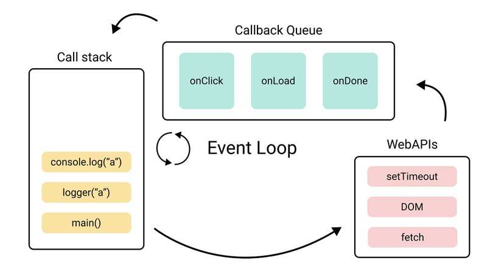

# 이벤트 루프(Event Loop)

- 자바스크립트의 동시성을 지원하는 것

<br/>

## 동시성(concurrency)

- **작업들이 빠르게 번갈아 실행되면서, 마치 동시에 실행되는 것처럼 보이는 현상**
- 자바스크립트는 **싱글 스레드 언어**이기 때문에 한 번에 하나의 작업만 처리할 수 있다.
    - 따라서 동시성을 보장하기 위해 **비동기 처리**와 **Non-blocking I/O 작업**을 적극적으로 활용한다.

<br/>

## 이벤트 루프가 동시성을 지원하는 방법

- **자바스크립트 엔진**: 소스코드의 평가와 실행을 담당하며, 싱글 스레드로 동작한다.
- **자바스크립트를 구동하는 런타임 환경(브라우저/Node.js)**: 타이머, I/O, 네트워크 등 자바스크립트 외의 기능을 제공하며, 멀티 스레드 기반의 구조를 가진다.
- 예시: `setTimeout`의 콜백 함수 코드 실행 자체는 자바스크립트 엔진이 담당하지만, 타이머의 시작과 완료 감지 및 콜백 큐 등록은 런타임 환경(브라우저 또는 Node.js)가 담당한다.

> 즉, 자바스크립트 엔진은 싱글 스레드이지만, **이를 구동하는 환경(브라우저나 Node.js)는 멀티 스레드 구조를 기반으로 하기 때문에 동시성을 지원할 수 있다.**
> - 브라우저: 타이머, 렌더링, 네트워크 등을 각각 별도의 스레드에서 처리
> - Node.js: `libuv`의 스레드풀을 활용하여 파일 I/O, DNS 등의 작업을 백그라운드 스레드에서 처리


<br/>

## 이벤트 루프 동작 과정



1. **콜 스택 확인**
    - 현재 실행 중인 작업(실행 컨텍스트)이 콜 스택에 있는지 반복해서 확인한다.
2. **태스크 큐 확인**  
    > 태스크 큐: `setTimeout`이나 `setInterval`과 같은 비동기 함수의 콜백 함수 또는 이벤트 핸들러가 일시적으로 보관되는 영역
    > 
    - 콜 스택이 비어있으면, 태스크 큐(콜백 큐)에 대기 중인 함수(콜백 함수, 이벤트 핸들러 등)가 있는지 확인한다.
3. **작업 이동**
    - 태스크 큐에 대기중인 작업이 있다면, 이를 콜 스택으로 순차적으로 이동시켜 실행한다. (FIFO)

> 즉, 이벤트 루프는 ‘비동기 함수들을 적절한 시점에 실행시키는 관리자’라고 볼 수 있다.

<br/>

## 매크로태스크와 마이크로태스크

이벤트 루프에서 처리되는 작업은 매크로태스크와 마이크로태스크로 나뉜다.

1. 매크로태스크(macrotask)
    - 주로 **큰 작업 단위**를 의미한다.
    - 일반적으로 `setTimeout`, `setInterval`, I/O 작업, 네트워크 요청 등의 비동기 작업이 포함된다.
    - 매크로태스크 큐에서 관리된다.
2. 마이크로태스크(microtask)
    - **매크로태스크보다 우선순위가 더 높고 작은 작업 단위**를 의미한다.
    - `Promise.then()`, `Promise.catch()`, `async/await`에서의 코드
    - 마이크로태스크 큐에서 관리된다.

> 이벤트 루프는 콜 스택이 비면, 먼저 마이크로태스크 큐에서 대기하고 있는 **모든** 함수를 가져와 실행한다. 이후 마이크로태스크 큐가 비면, 매크로태스크 큐에서 대기하고 있는 함수를 가져와 실행한다.  
→ 이런 처리순서가 아주 중요한 이유는 (마우스 좌표 변경이나 네트워크 통신에 의한 데이터 변경 같이 애플리케이션 환경에 변화를 주는 작업에 영향을 받지 않고) 모든 마이크로태스크를 동일한 환경에서 처리할 수 있기 때문이다. (출처: 모던 JavaScript 튜토리얼)


<br/>


# 클로저(Closure)

클로저는 자바스크립트의 고유의 개념이 아니다. 함수를 일급 객체로 취급하는 **함수형 프로그래밍 언어**에서 사용되는 중요한 특성이다.

그렇기 때문에 클로저는 ECMAScript 사양에 없고, MDN에서는 클로저에 대해 다음과 같이 정의한다.

> A closure is the combination of a function and the lexical environment within which that function was declared
 

정리하면, 클로저란 **자신이 선언된 당시의 환경을 기억**하여, 생명 주기가 끝난 **외부 함수의 변수 접근**할 수 있는 내부 함수를 말한다.

<br/>

## 렉시컬 스코프

자바스크립트 엔진은 함수를 어디서 호출했는지가 아니라 **함수를 어디에 정의했는지**에 따라 상위 스코프를 결정한다. 이를 렉시컬 스코프(정적 스코프)라 한다.

> 렉시컬 환경의 “외부 렉시컬 환경에 대한 참조”에 저장할 참조값, 즉 **상위 스코프에 대한 참조**는 함수 정의가 평가되는 시점에 함수가 정의된 환경(위치)에 의해 결정된다. 이것이 바로 렉시컬 스코프다.

<br/>


## [[Environment]]

함수는 자신의 내부 슬롯 `[[Environment]]`에 **자신이 정의된 환경**, 즉 **상위 스코프의 참조**를 저장한다.

그리고 이때 `[[Environment]]`에 저장된 상위 스코프의 참조는 현재 실행 중인 실행 컨텍스트의 렉시컬 환경을 가리킨다.

> 함수 객체는 내부 슬롯 `[[Environment]]`에 저장한 렉시컬 환경의 참조, 즉 상위 스코프를 자신이 존재하는 한 기억한다.

<br/>


## 클로저와 렉시컬 환경

```jsx
const x = 1;

function outer() {
	const x = 10;
	const inner = function () { console.log(x); };
	return inner;
}

// outer 함수를 호출하면 중첩 함수 inner를 반환한다.
// 그리고 outer 함수의 실행 컨텍스트는 실행 컨텍스트 스택에서 팝되어 제거된다.
const innerFunc = outer();
innerFunc();
```

> 외부 함수보다 중첩 함수가 더 오래 유지되는 경우, 중첩 함수는 이미 생명 주기가 종료한 외부 함수의 변수를 참조할 수 있다. 이러한 중첩 함수를 클로저라고 부른다.
> 

outer 함수의 실행이 종료하면 inner 함수를 반환하면서 outer 함수의 생명 주기가 종료된다. 즉, outer 함수의 실행 컨텍스트가 실행 컨텍스트 스택에서 제거된다.

그러나 이때 outer 함수의 실행 컨텍스트는 실행 컨텍스트 스택에서 제거되지만, **outer 함수의 렉시컬 환경까지 소멸하는 것은 아니다.**

> outer 함수의 렉시컬 환경은 inner 함수의 `[[Environment]]` 내부 슬롯에 의해 참조되고 있고, inner 함수는 전역 변수 innerFunc에 의해 참조되고 있으므로 가비지 컬렉션의 대상이 되지 않기 때문이다.

자바스크립트의 모든 함수는 상위 스코프를 기억하므로 이론적으로 모든 함수는 클로저다.

하지만 일반적으로 모든 함수를 클로저라고 하지는 않는데, 상위 스코프의 어떤 식별자도 참조하지 않는 경우 대부분의 모던 브라우저는 최적화를 통해 상위 스코프를 기억하지 않기 때문이다. (메모리 낭비)

> 클로저는 중첩 함수가 **상위 스코프의 식별자를 참조**하고 있고 **중첩 함수가 외부 함수보다 더 오래 유지되는 경우**에 한정하는 것이 일반적이다.

<br/>

## 클로저의 활용

클로저는 상태를 안전하게 변경하고 유지하기 위해 사용한다. 즉, **상태를 안전하게 은닉**하고 **특정 함수에게만 상태 변경을 허용**하기 위해 사용한다.

1. 카운터 예제 (기본)
    
    `num`이 전역 변수로 관리되고 있기 때문에 안전하지 않다.
    
    ```jsx
    let num = 0;
    
    const increase = function () {
    	return ++num;
    };
    
    console.log(increase());  // 1
    console.log(increase());  // 2
    console.log(increase());  // 3
    ```
    
2. num 변수의 상태를 increase 함수만이 변경할 수 있게 수정
    
    그러나 `num`이 이전 상태를 유지하지 못한다.
    
    ```jsx
    const increase = function () {
    	let num = 0;
    	
    	return ++num;
    };
    
    console.log(increase());  // 1
    console.log(increase());  // 1
    console.log(increase());  // 1
    ```
    
3. 이전 상태를 유지하도록 클로저를 사용하여 수정
    
    ```jsx
    const increase = (function() {
    	let num = 0;
    	
    	// 클로저
    	return function () {
    		return ++num;
    	};
    }());
    
    console.log(increase());  // 1
    console.log(increase());  // 2
    console.log(increase());  // 3
    ```
    
    위 코드가 실행되면 즉시 실행 함수가 호출되고, 즉시 실행 함수가 반환한 함수가 increase 변수에 할당된다.  increase 변수에 할당된 함수는 자신이 정의된 위치에 의해 결정된 상위 스코프인 즉시 실행 함수의 렉시컬 환경을 기억하는 클로저다.
    

> 외부 상태 변경이나 가변 데이터를 피하고, 불변성을 지향하는 함수형 프로그래밍에서 부수 효과를 최대한 억제하여 오류를 피하고 프로그램의 안정성을 높이기 위해 클로저는 적극적으로 사용된다.


<br/>


# 가비지 컬렉션(Garbage Collection, GC)

## 가비지 컬렉션이란?

> 가비지 컬렉션은 더 이상 필요하지 않은 메모리를 자동으로 해제해 주는 메커니즘이다.
> 

자바스크립트는 **자동 메모리 관리(Auto Memory Management)** 언어이기 때문에 개발자가 명시적으로 메모리를 해제할 필요가 없다. 대신, **가비지 컬렉터(Garbage Collector)** 가 주기적으로 실행되어, **더 이상 사용되지 않는 객체를 메모리에서 제거**함으로써 메모리 누수를 방지한다.

<br/>


## 가비지 컬렉션 방식

### 1. 참조 카운팅(Reference Counting)

- 가장 단순한 방식
- 어떤 값(객체)이 몇 번 참조되고 있는지 카운팅한다.
- 카운트가 0이 되면(= 더 이상 어떤 변수에서도 참조하지 않게 되면) GC 대상이 된다.
- 문제점: 순환 참조가 생기면 메모리를 해제하지 못한다. → 메모리 누수
    
    ```jsx
    const a = {};
    const b = {};
    
    a.other = b;
    b.other = a;
    // a, b는 서로를 참조하므로 참조 카운트는 0이 아니므로 GC 대상이 되지 않음
    ```

<br/>


### 2. 도달 가능성 기반(Reachability / Mark-and-Sweep)

- 현재 대부분의 자바스크립트 엔진이 사용하는 방식
- 루트 객체로부터 도달 가능한 객체는 살아있는 것으로 간주
    
    > 루트: 태생부터 도달 가능한 값들 (현재 함수의 지역 변수와 매개변수, 전역 변수 등)
    > 
    - 루트에서부터 접근이 불가능한 객체들은 가비지로 판단되어 메모리에서 제거됨
- 동작 과정
    1. **Mark**: 루트에서 출발하여 도달 가능한 객체를 모두 표시
    2. **Sweep**: 표시되지 않은 객체를 메모리에서 해제
- 최적화 기법
    - **generational collection(세대별 수집)**: 객체를 ‘새로운 객체’와 ‘오래된 객체’로 나눈다. 객체 상당수가 만들어지자마자 그 쓸모를 다하는데, 이런 객체를 ‘새로운 객체’로 보고 공격적으로 메모리에서 제거한다. 일정 시간 이상 살아남은 객체는 ‘오래된 객체’로 분류하고, 가비지 컬렉터가 덜 감시한다.
    - **incremental collection(점진적 수집**): 방문해야 할 객체가 많다면 모든 객체를 한 번에 방문하고 mark하는 데 상당한 시간과 리소스가 소모된다. 이런 현상을 개선하기 위해 자바스크ㄹ비트 엔진은 가비지 컬렉션을 여러 부분으로 분리한 다음, 각 부분을 별도로 수행한다. (긴 지연 → 짧은 지연 여러 개로 분산)
    - **idle-time collection(유휴 시간 수집)**: 가비지 컬렉터는 실행에 주는 영향을 최소화하기 위해 CPU가 유휴 상태일 때만 가비지 컬렉션을 실행한다.

<br/>

## 메모리 해제 이슈와 해결 방법

### 클로저

- 클로저를 잘못 사용하면 오래된 컨텍스트를 불필요하게 유지하게 될 수 있고, 이는 메모리 누수로 이어질 수 있다.
    
    ```jsx
    function outer() {
    	const bigData = new Array(10000).fill("data");
    	
    	return function inner() {
    		console.log(bigData[0]);  // inner가 bigData를 참조
    	};
    }
    
    const closureFn = outer();
    // closureFn이 살아있는 동안 bigData는 GC되지 않음
    ```
    
- 해결 방법
    - 참조 제거 또는 구조 변경

<br/>

### 이벤트 리스너

- ex) `button`이 DOM에서 제거되어도 이벤트 리스너가 남아 있으면, 해당 DOM 노드와 리스너 모두 GC되지 않는다.
    
    ```jsx
    const button = document.querySelector("#btn");
    button.addEventListener("click", () => {
    	console.log("clicked");
    });
    ```
    
- 해결 방법
    - `removeEventListener` 호출

<br/>

### DOM 노드

- DOM 노드를 자바스크리트 객체와 상호 참조하면, GC되지 않고 메모리 누수가 발생할 수 있다.
    
    ```jsx
    function attach() {
    	const node = document.getElementById("box");
    	node.myRef = node;  // 순환 참조
    }
    ```
    
- 해결 방법
    - 참조 해제 또는 `WeakMap` 사용

<br/>

## WeakMap과 WeakSet

- 자료구조를 구성하는 요소는 자신이 속한 자료구조가 메모리에 남아있는 동안 도달 가능한 값으로 취급되어 메모리에서 삭제되지 않는다.
    - ex) 객체의 프로퍼티나 배열의 요소, 맵이나 셋을 구성하는 요소들
    
    ```jsx
    let john = { name: "john" };
    
    john = null;  // 객체가 메모리에서 해제됨
    ```
    
    ```jsx
    let john = { name: "john" };
    let array = [ john ];
    john = null;
    
    // john을 나타내는 객체는 배열의 요소이기 때문에, 위에서 null이 할당되었지만 가비지 컬렉션의 대상이 되지 않음
    alert(JSON.stringify(array[0]));
    ```
    

<br/>

### 메모리 관리를 도와줄 수 있는 WeakMap과 WeakSet

- **WeakMap**
    - Map과 유사하지만, weakMap의 key는 반드시 객체여야 한다.
    - get, set, delete, has 메서드만을 지원한다. (iterable X)
    - 키로 사용된 객체가 참조되지 않으면 자동으로 GC 대상이 된다.
        
        ```jsx
        let obj = {};
        const map = new WeakMap();
        map.set(obj, 'value');
        
        // 이후 obj = null 하면 객체와 값 모두 GC 대상이 됨 
        obj = null;
        ```
        
- WeakSet
    - Set과 유사하지만, 객체만 저장할 수 있다.
    - Set 안의 객체는 도달 가능할 때만 메모리 상에서 유지된다.
    - add, has, delete 메서드만을 지원한다. (size, keys나 반복 작업 관련 메서드 X)
        
        ```jsx
        let visitedSet = new WeakSet();
        
        let john = { name: "John" };
        let pete = { name: "Pete" };
        let mary = { name: "Mary" };
        
        visitedSet.add(john); // John이 사이트를 방문합니다.
        visitedSet.add(pete); // 이어서 Pete가 사이트를 방문합니다.
        visitedSet.add(john); // 이어서 John이 다시 사이트를 방문합니다.
        
        // visitedSet엔 두 명의 사용자가 저장될 겁니다.
        
        // John의 방문 여부를 확인해보겠습니다.
        alert(visitedSet.has(john)); // true
        
        // Mary의 방문 여부를 확인해보겠습니다.
        alert(visitedSet.has(mary)); // false
        
        john = null;
        
        // visitedSet에서 john을 나타내는 객체가 자동으로 삭제됩니다.
        ```
        
<br/>

# 면접 질문 정리

- **setTimeout(fn, 0)이 바로 실행되지 않는 이유는?**
    - setTimeout은 Web API에서 제공하는 비동기 함수로, 콜백 함수는 지정된 시간이 지난 후 태스크 큐에 등록됩니다. 이벤트 루프는 현재 실행 중인 콜 스택이 비어야만 태스크 큐에서 작업을 가져와 실행할 수 있기 때문에, 지연 시간이 0ms이더라도 콜 스택이 비워진 이후에야 실행됩니다. 즉, `setTimeout(fn, 0)`은 최소 지연 시간이 0ms인 것이지, 즉시 실행된다는 뜻은 아닙니다.
- **Promise의 then과 setTimeout의 실행 순서는?**
    - Promise.then은 마이크로태스크, setTimeout은 매크로태스크로 분류됩니다. 이벤트 루프는 한 번의 루프 사이클마다 마이크로태스크 큐를 먼저 모두 비운 후 매크로태스크 큐를 처리합니다. 따라서 Promise.then은 setTimemout 콜백 함수보다 항상 먼저 실행됩니다.
- **async/await 가 이벤트 루프, 콜스택 등등에서 어떻게 동작하는지**
    - `async/await`는 자바스크립트의 비동기 처리 문법으로, 내부적으로는 `Promise` 기반으로 동작합니다. `await` 키워드를 만나면, 해당 지점에서 **Promise가 처리될 때까지 함수 실행을 일시 중단**하고, `await` 이후의 코드는 **마이크로태스크 큐에 등록**됩니다. 이후 이벤트 루프는 **콜 스택이 비어 있으면 마이크로태스크 큐의 작업을 먼저 처리**하기 때문에, `await` 이후의 코드는 `setTimeout` 같은 매크로태스크 큐보다 항상 먼저 실행됩니다.
- **JS에서 메모리 누수가 발생하는 사례는?**
    - 자바스크립트는 가비지 컬렉터가 자동으로 메모리를 관리하지만, 개발자가 참조를 의도치 않게 유지할 경우 메모리 누수가 발생할 수 있습니다. 대표적으로 전역 변수를 사용하거나, 이벤트 리스너를 제거하지 않았을 때, 클로저를 잘못 사용했을 때 등이 있습니다.
- **클로저가 왜 메모리 누수를 유발할 수 있나요?**
    - 클로저는 함수가 선언될 때의 렉시컬 환경을 기억하기 때문에, 외부 스코프의 변수들을 참조한 채로 메모리에 유지됩니다. 이 상태에서 해당 클로저가 계속 참조되고 있으면, 클로저 내부에 있는 불필요한 변수들도 GC 대상에서 제외되기 때문에 메모리 누수가 발생할 수 있습니다.
- **GC가 발생하는 타이밍은 언제인가요?**
    - 명확한 시점을 알 수는 없습니다. 가비지 컬렉터는 자바스크립트 엔진이 자동으로 관리하며, 객체가 더 이상 참조되지 않을 때 메모리 해제를 위해 GC가 실행될 수 있습니다. 그러나 실제 실행 시점은 엔진의 최적화 전략과 메모리 상태에 따라 다릅니다.
- **클로저와 캡슐화의 관계를 설명해보세요.**
    - 클로저는 자바스크립트에서 캡슐화를 구현할 수 있는 대표적인 도구입니다. 클로저를 활용하면 외부에서 접근할 수 없는 private 변수를 만들 수 있고, 해당 변수에 접근하거나 수정할 수 있는 함수만 노출할 수 있습니다.